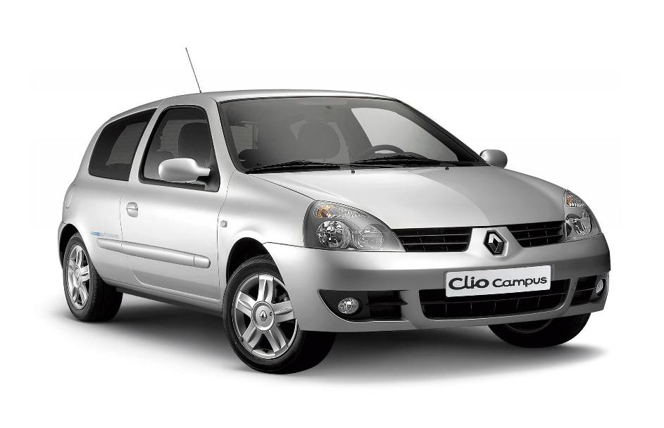

# Esto es un título de primer nivel (h1)
## Esto es un título de segundo nivel (h2)
### Esto es un título de tercer nivel (h3)

Esto es una lista sin orden
- Primer término.
- Segundo término.
- Tercer término.

Esto es una lista ordenada
1. Primer término.
2. Segundo término.
3. Tercer término.

<!---->



<!-- Esto es un comentario.
    Se llaman líneas comentadas o líneas silenciadas. -->

| Nombre | ¿Dónde vivo? | ¿Por qué? |
| -- | -- | -- |
| Paco | San Lorenzo de El Escorial | Para aprender |
| Hugo | San Lorenzo de El Escorial | Para aprender |

``` js

console.log('Hola Mundo')

```
